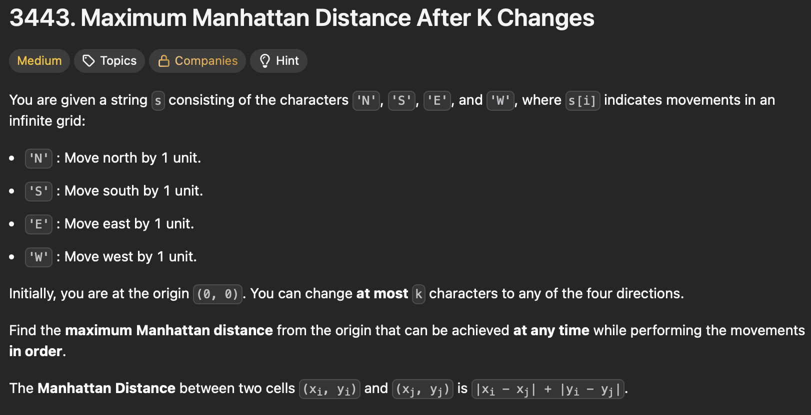
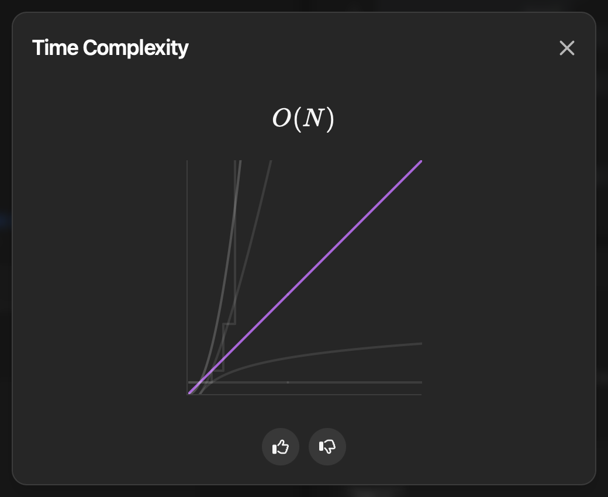
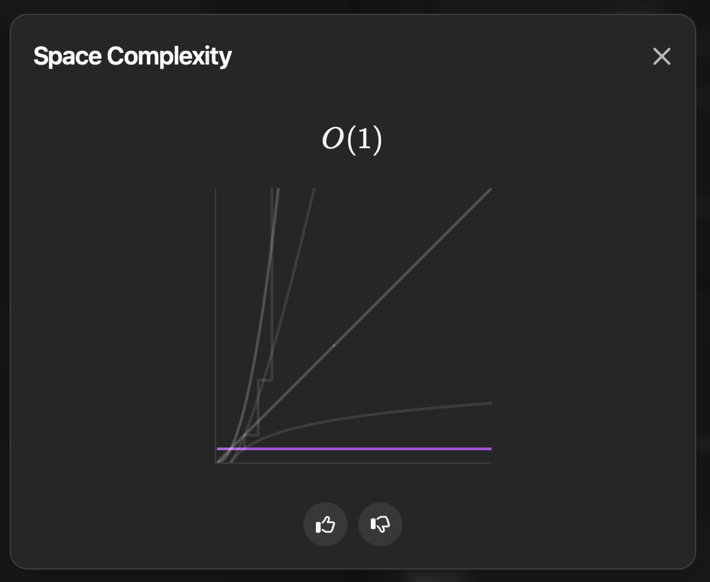

## Day - 05   (20-06-2025)

## Problem: [3443. Maximum Manhattan Distance After K Changes](https://leetcode.com/problems/maximum-manhattan-distance-after-k-changes/?envType=daily-question&envId=2025-06-20)
### Description - 


### Approach - 01 ( Brute Force )

``` Python 
class Solution:
    def maxDistance(self, st: str, k: int) -> int:
        ans = 0
        n =s=w=e=0
        r = len(st)
        for i in range(r):
            c = st[i]
            if c=="N":
                n+=1
            elif c=="S":
                s+=1
            elif c=="E":
                e+=1
            else:
                w+=1
            m = abs(n-s) + abs(e-w)
            dis = m + min(2*k , i+1-m)
            ans = max(ans,dis)
        return ans


```
So today's problem kinda felt easy but took really a lot of time to solve. The problem here is instead of counting and testing all ways we have to think logically! (what I mean is brute force really doesn't work here). After so many approaches finally all of the test cases ran perfectly. Initially the code which I implemented had problem with only one test case uk and it hurts when this happens and I wasn't able to fix that one test case for so long!! :( 
    But now we have solved it!! So the easy way to find manhattan distance is to take  summation of difference in north , south and difference in east , west. 
    For each time we loop, we will have to maintain this under manhattan distance current and have to check whether we can make any changes or not. The logic here is, we can only make a change if the manhattan distance is not equal to the length (as it is the best case)
    

Time Complexity - O(N) 


Space Complexity - O(1)


<!-- ### Approach - 02 ( Optimal Solution )


``` Python

```
Time Complexity - O() \
Space Complexity - O() -->


<br> <p align="center"> ❤️ With love, <strong>Soha</strong> ❤️ </p> 