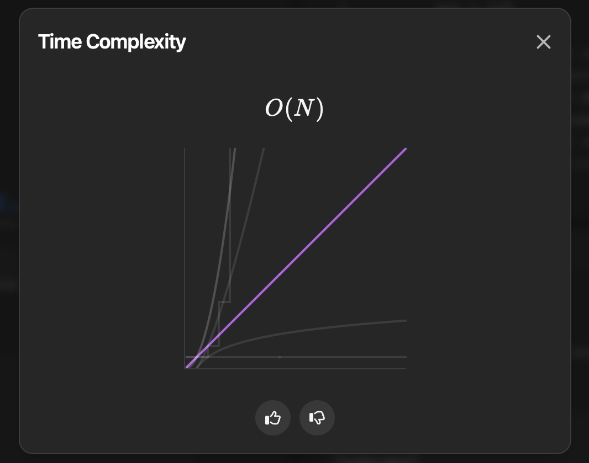

## Day - 06  (21-06-2025)

## Problem: [3085. Minimum Deletions to Make String K-Special](https://leetcode.com/problems/minimum-deletions-to-make-string-k-special/?envType=daily-question&envId=2025-06-21)
### Description - 

### Approach - 01 ( Brute Force )
It is already 6th day!! Today was really a hectic day, I am not a state to explain this today, but I will surely add explanation here some other day.
``` Python 
class Solution:
    def minimumDeletions(self, word: str, k: int) -> int:
        count = Counter(word)
        
        arr = []
        for ch in ascii_lowercase:
            arr.append(count[ch])

        ans = 1e9
        for mid in arr:
            remove_count = 0
            for val in arr:
                if val < mid: 
                    remove_count += val
                elif val <= mid + k:
                    continue
                else:
                    remove_count += (val - (mid + k))
            ans = min(ans, remove_count)
        return ans

```


Time Complexity - O(N) 



Space Complexity - O(1)

<!-- ### Approach - 02 ( Optimal Solution )


``` Python

```
Time Complexity - O() \
Space Complexity - O()
 -->


<br> <p align="center"> ❤️ With love, <strong>Soha</strong> ❤️ </p> 