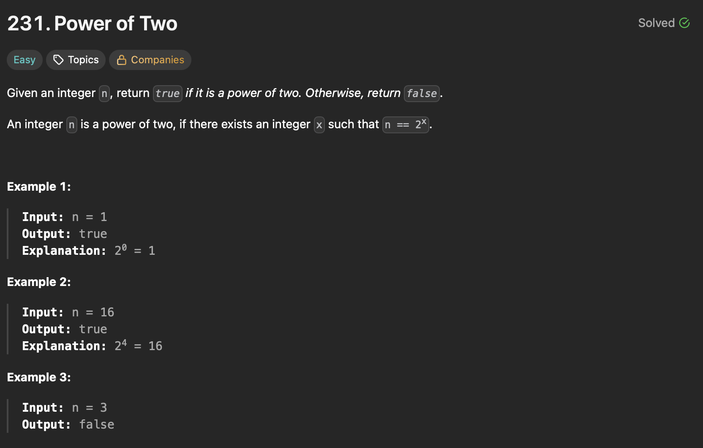
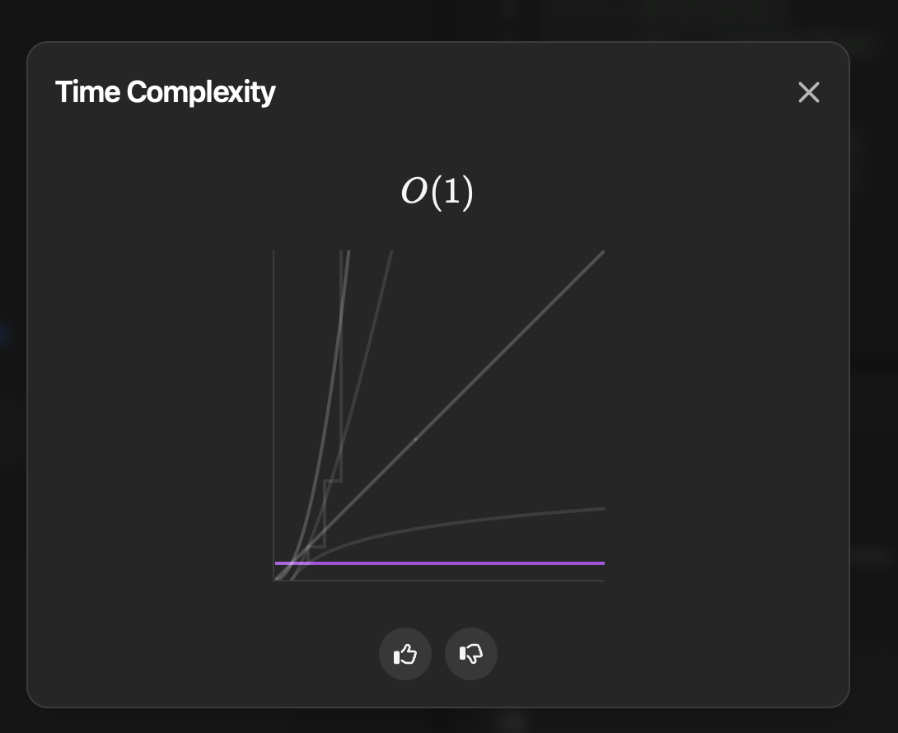

## Day - 01  (09-08-2025)
It is been one entire month and a few couple of days for me to get back here where I wanted to maintain consistency and solve LeetCode daily and document it here but due to a few reasons I wasn't able to be consistent but now I will try to be!!
## Problem: [231. Power of Two](https://leetcode.com/problems/power-of-two/description/?envType=daily-question&envId=2025-08-09)
### Description - 



### Approach - 01 ( Brute Force )
So, my first approach is very simple and basic brute force where I am solving the question O(logN) time using a while loop. So, we understand that for a number to be power of 2 it should be dividable by 2 i.e if we keep on dividing the number by 2 if it is divisible by 2 then it can surely be power of 2 else there is no chance of it being the power of 2.

``` Python 
class Solution:
    def isPowerOfTwo(self, n: int) -> bool:
        while n>1:
            if n%2==0:
                n=n//2
            else:
                break
        if n==1:
            return True
        return False
```


Time Complexity - O(logN) \
Space Complexity - O(1)

### Approach - 02 ( Optimal Solution )
Here we are suing bit manipulation and our brains of course to further bring down the time complexity to O(1). If we think of numbers which are powers of 2, then we will surely have 1 followed by 0's if we convert it to binary. That means if we do and "AND" operation in between n and n-1, we surely are gonna get a 0.

``` Python
class Solution:
    def isPowerOfTwo(self, n: int) -> bool:
        if n<=0:
            return False
        if (n & n-1)==0:
            return True
        return False
```
Time Complexity - O(1) \
Space Complexity - O(1)

### Approach - 03 ( Optimal Solution )


``` Python
class Solution:
    def isPowerOfTwo(self, n: int) -> bool:
        if n<=0:
            return False
        return 2**30%n==0
```
Time Complexity - O(1) \
Space Complexity - O(1)


<br> <p align="center"> ❤️ With love, <strong>Soha Farhana</strong> ❤️ </p> 